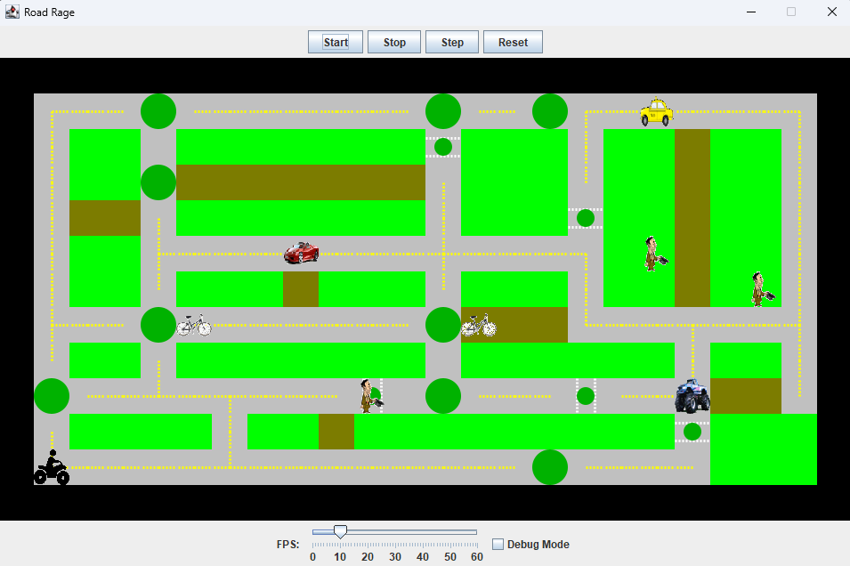

## **Introduction**
pitroeth@gmail.com\
My name is Ethan Pitroff, an undergraduate student at UW Tacoma enrolled in the Computer Science major. My primary interest is in software development and engineering.
BA in Computer Science, looking for Software Engineer jobs/internships!

## **About Me**
Born and raised Washingtonian, specifically the Olympia/Lacey area. My current level of education is my in progress BA in Computer Science, with a minor in History. My long term career goals are a position at PNNL (Pacific Northwest National Labaratory) or a space agency, like NASA or SpaceX. 
My love of computers and programming stems from my dad, who got me interested in the field in general at a very young age because of his love of it. While he has always been interested in the IT and networking side of technology, I grew attached to the coding aspect. Outside of my coursework at UW Tacoma, I plan on joining Huscii Developers, a extracurricular club at UW Tacoma focusing on coding, as well as participating in any extracuricular programs I can to broaden my portfolio!

## **Projects:**

#### **Road Rage**
\
Road Rage project, working with a provided GUI and creating the backend inheritance for it.\
Created using the IntelliJ IDE and Java language.\
The main point of this project was to check our understanding and usage of inheritance and JUnit tests.\
I solved this project by taking it one step at a time; I completed the AbstractVehicle class first, which was simple. 
The first major part of the project I did was the Truck class, which I used as the baseline for the code that I wrote for every other vehicle class.

#### **Bookstore**
\
Bookstore project, finishing the code of a project that was given to us.\
Created using the IntelliJ IDE and Java language.\
This project was given to have us properly look over and fix code that someone else provided, and to learn JUnit tests.\
The actual class coding of this assignment wasn't too difficult (Item, ItemOrder, and Cart) because the specifications were already given to me.
This project really let me put into practice the JUnit 5 tests we learned in class, and cemented them as a staple tool that I will end up using for the rest of my time with this programming language.

#### **Shapes**
\
Shapes project, creating  classes that inherit from one abstract class.\
Created using the IntelliJ IDE and Java language.\
This project was to relearn inheritance, as well as use Checkstyle, PMD, and SpotBugs.\
The project itself was relatively simple, and didn't pose much of a challenge once I actually started.\
The real experience gained from this (for me) was the use of the plugins, which are something that I now use on every code I write once I'm finished with it. 
Checkstyle and PMD are both useful for finding issues with how I've written my code, while SpotBugs does exactly what its name implies.

## **Skills**
1. Coding Languages\
  -Java\
  -Python
2. Communication
  -Public Speaking and Presenting\
  -Group Work
4. Time Management
5. Design Patterns\
  -Abstract Factory\
  -Model View Controller
6. Object Oriented Programming
7. JUnit 5 tests

## **Experience**
Undergraduate student at the University of Washington Tacoma branch; BA in Computer Science.

## **Contact**
**Email:**  pitroeth@gmail.com\
[My LinkedIn](https://www.linkedin.com/in/ethan-pitroff-428120395)
[My GitHub Profile](https://github.com/pitroeth)
